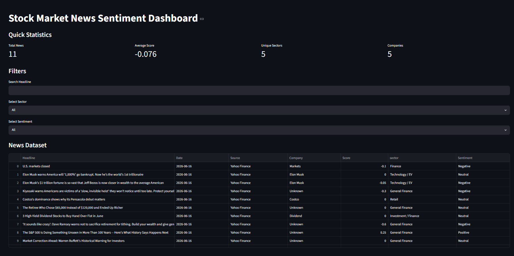
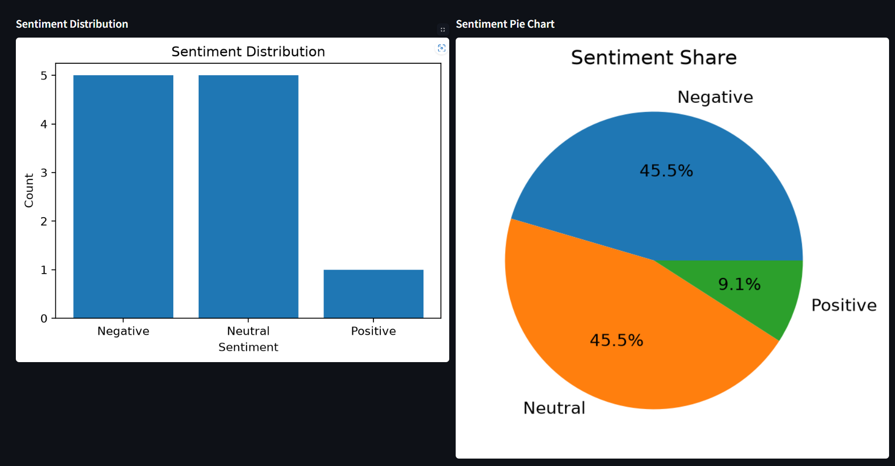
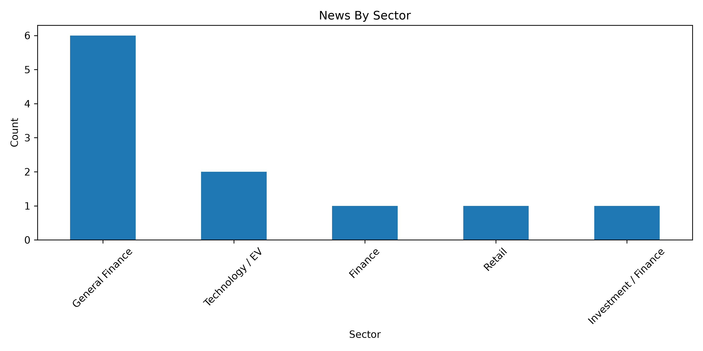

# 📈 Stock Market News Scraper & Sentiment Analysis System

#### Hello, I'm Manisha. I built this project to collect stock market news from online sources, perform sentiment analysis on financial news articles, and visualize market sentiment through an interactive dashboard.

#### News Sources:

* Yahoo Finance
* Economic Times
* Moneycontrol
* Financial News Websites

#### A Python-based system that automatically scrapes stock market news, analyzes sentiment using NLP techniques, stores processed data, and presents insights through a Streamlit dashboard.

---

# Features

### 🔷 Automated News Scraping

### 🔷 Real-Time Financial News Collection

### 🔷 Sentiment Analysis (Positive, Neutral, Negative)

### 🔷 News Data Cleaning & Processing

### 🔷 Sentiment Distribution Analysis

### 🔷 Market Mood Visualization

### 🔷 Interactive Streamlit Dashboard

### 🔷 CSV Data Storage

### 🔷 Data Filtering & Search

---

# 📸 Screenshots

## Dashboard



## Sentiment Analysis



## News Distribution



---

# 🏗️ Project Architecture

```text
News Websites
      │
      ▼
Web Scraper
      │
      ▼
Raw News Data
      │
      ▼
Data Cleaning
      │
      ▼
Sentiment Analysis
      │
      ▼
CSV Storage
      │
      ▼
Visualization
      │
      ▼
Streamlit Dashboard
```

---

# 📂 Project Structure

```text
Stock_Market_News_Project/
│
├── scraper.py
├── analysis.py
├── dashboard.py
│
├── DATA/
│   └── news.csv
│
├──Reports/
│  └── report.txt
│
├── requirements.txt
├── README.md
│
├── Analysis/
│   ├── sentiment_distribution.png
│   ├── sector_distribution.png
│   ├── top_keywords.png
│   ├── cleaned_new.csv
│   ├── top_keywords.csv
│   ├── top_negative_news.csv
│   ├── top_positive_news.csv
│   └── summary_report.txt
│
├── Screenshots/
│   ├── dashboard.png
│   ├── sentiment_analysis.png
│   └── news_distribution.png
│
└── Documentation/
    ├── Project_Report.md
    └── Presentation.pptx
```

---

# 🛠️ Technologies Used

## Programming Language

* ### Python

## Libraries

* ### Requests
* ### BeautifulSoup4
* ### Pandas
* ### NumPy
* ### TextBlob
* ### NLTK
* ### Matplotlib
* ### Plotly
* ### Streamlit

## Tools

* ### VS Code
* ### GitHub

---

# ⚙️ Installation

## Clone the repository

#### git clone https://github.com/manishajangir9509-code/Stock_Market_News_Project.git

```bash
cd Stock_Market_News_Project
```

## Install Dependencies

```bash
pip install -r requirements.txt
```

---

# ▶️ How to Run

### Step 1: Scrape Latest News

```bash
python scraper.py
```

### Step 2: Perform Sentiment Analysis

```bash
python analysis.py
```

### Step 3: Launch Dashboard

```bash
python -m streamlit run dashboard.py
```

---

# 📊 Analysis Performed

* ### News Sentiment Classification
* ### Positive News Analysis
* ### Negative News Analysis
* ### Neutral News Analysis
* ### Source-Wise News Analysis
* ### Sentiment Distribution Visualization
* ### Market Mood Detection

---

# 🧠 Sentiment Analysis Method

## The project uses:

* ### TextBlob Sentiment Analysis
* ### Natural Language Processing (NLP)
* ### Polarity Score Calculation
* ### News Classification

### Sentiment Categories:

| Polarity Score | Sentiment |
| -------------- | --------- |
| > 0            | Positive  |
| = 0            | Neutral   |
| < 0            | Negative  |

---

# 📈 Dashboard Features

### ✅ View Latest Stock Market News

### ✅ Filter News by Sentiment

### ✅ Sentiment Pie Charts

### ✅ Sentiment Bar Charts

### ✅ Source-wise Analysis

### ✅ Real-Time Data Display

### ✅ Interactive Visualizations

---

# 📊 Results

## The system successfully:

* ### Collected Financial News
* ### Cleaned and Processed News Data
* ### Analyzed News Sentiment
* ### Classified Positive/Negative News
* ### Generated Visual Insights
* ### Displayed Results Through Dashboard

---

# 🔄 Future Improvements

* ### Live News API Integration
* ### Advanced NLP Models
* ### FinBERT Sentiment Analysis
* ### Real-Time Stock Price Correlation
* ### News Impact Prediction
* ### AI-Based Market Trend Detection
* ### Email Alert System

---

# 👨‍💻 Author

## *Manisha Jangir*

#### Python Developer

#### GitHub: https://github.com/manishajangir9509-code

---

# 📜 License

### This project is licensed under the MIT License.

---

# ⭐ Support

#### If you found this project useful, consider giving it a star ⭐ on GitHub.
